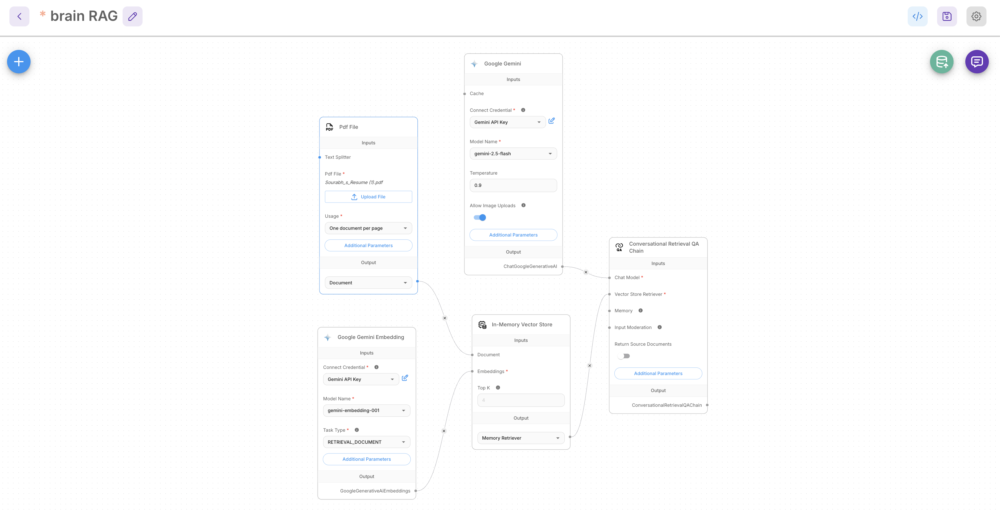
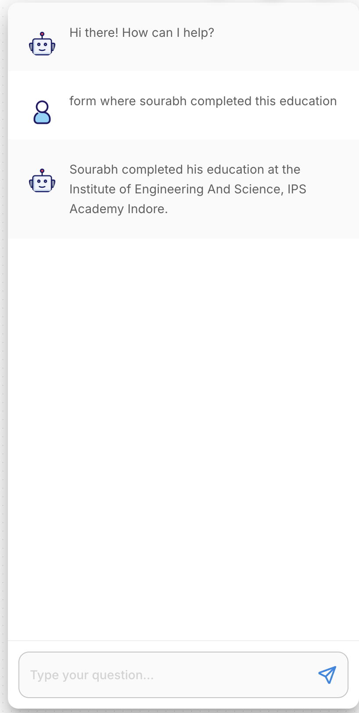
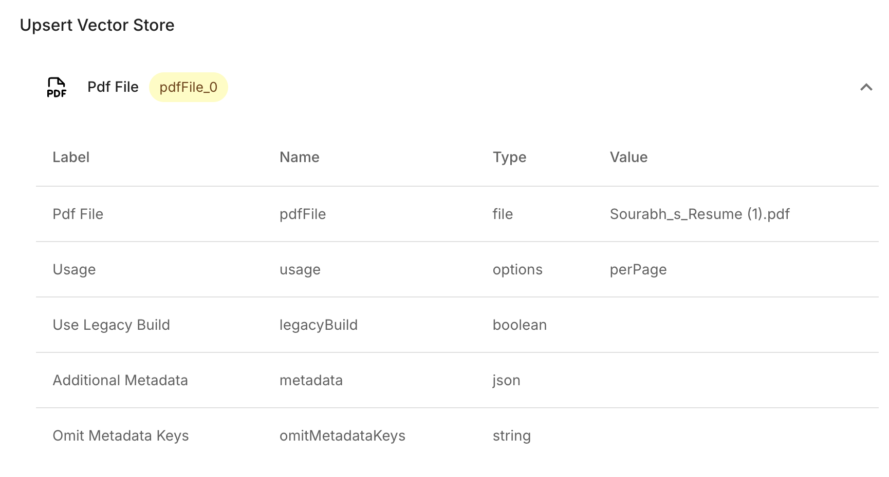
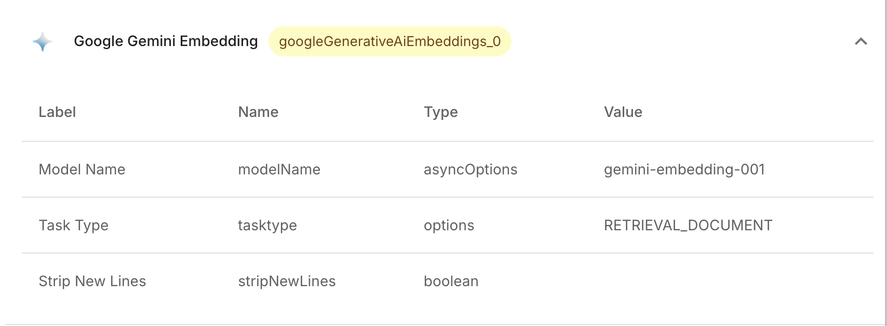
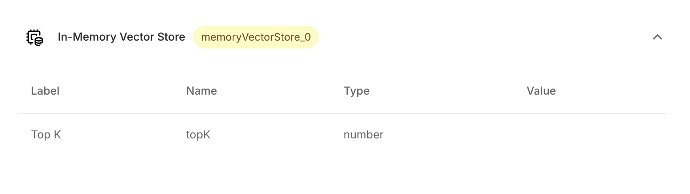

# 🧠 Brain RAG Flowise Chat App

A sleek, intuitive chat application built with React Native and Expo. This app functions as a sophisticated mobile client that connects directly to a Flowise AI backend utilizing RAG (Retrieval-Augmented Generation) capabilities, offering users intelligent, context-aware responses seamlessly.

## ✨ Key Features
- **Real-Time AI Chat:** Integrates directly with a hosted Flowise predictive model wrapper to handle deep conversational logic.
- **Modern User Interface:** A carefully designed dynamic chat layout with smooth typing indicators, intuitive message bubbles, and responsive styling.
- **RAG Powered:** Delivers highly accurate answers by relying on your tailored knowledge base and AI data retrievals.

## 📸 Screenshots

Here is a glimpse of the application in action:

| Chat View 1 | Chat View 2 | Chat View 3 |
| :---: | :---: | :---: |
|  |  |  |
|  |  | |

## 🚀 Download Full Release (APK)

You don't need to build from source to try out the app. An Android APK has been pre-built and is available right within this repository!

👉 **[Download Android APK Here](releases/brain-RAG-flowise-app-release.apk)**

## 🛠️ Quick Start & Local Development

If you'd like to run it locally or build it yourself:

1. **Install Dependencies:**
   ```bash
   npm install
   ```
2. **Start the Expo Server:**
   ```bash
   npx expo start
   ```
3. **Run on your device:** Scan the QR code using the Expo Go app.
